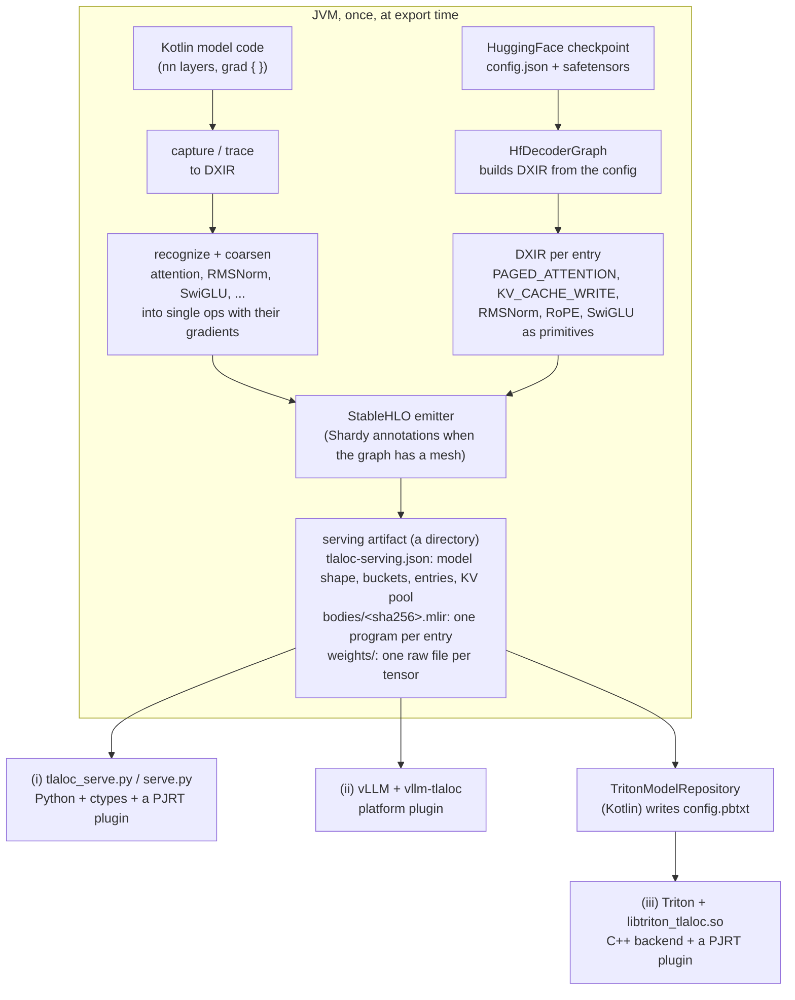

# How serving works in Tlaloc

Kotlin turns a model into a directory of StableHLO programs and weight files,
then exits. Something else runs that directory: a Python process with no
framework in it, vLLM, or NVIDIA Triton. None of the three calls back into
the JVM.

This page describes the path from a model to a running server, what each of
the three servers is for, which process does what, where the memory lives,
and what has run on which hardware. The commands are in
[SERVING_RUNBOOK.md](SERVING_RUNBOOK.md) and [triton/README.md](../triton/README.md);
[examples/triton-llm](../examples/triton-llm/) runs the whole path in one script.



## 1. From a model to DXIR

DXIR is Tlaloc's graph IR: typed tensors, one `OpKind` per node. Two routes
lead into it.

**A HuggingFace checkpoint.** `HfDecoderGraph` (in `:ir`) reads the
checkpoint's `config.json` through an `HfModelFamily` (Llama, Qwen3, Muse
Glimmer) and builds the decoder directly with `DxirBuilder`, one graph per
compiled entry:

```
embed → [rms_norm]
per layer: rms_norm → q/k/v → [q/k rms_norm] → [RoPE] → KV_CACHE_WRITE ×2
           → PAGED_ATTENTION (full or sliding window) → [× sigmoid(gate)] → o_proj → +residual
           → rms_norm → SwiGLU → down_proj → +residual
final rms_norm → lm_head → [soft-cap] → logits
```

A checkpoint that ties its head to the embedding table (Qwen3) gets no head
weight: `lm_head` is one `MATMUL` with explicit contracting dims (the hidden
axis of the final state and of the table, a `dot_general` with
`contracting_dims = [1] x [1]`), so the table is on the device once. In the
reference interpreter it gives the logits of a transposed copy bit for bit.

Paged attention and the KV cache write are ops of their own
(`OpKind.PAGED_ATTENTION`, `OpKind.KV_CACHE_WRITE`). They are inference-only:
both reverse-mode and forward-mode AD refuse them by name. RMSNorm, RoPE and
SwiGLU are written out as primitive arithmetic (reduce, rsqrt, multiply,
logistic, slices). The steps in brackets are switched on per layer by the
family.

A graph is either a **decode** entry (one new token per sequence, batch `B`)
or a **prefill** entry (a chunk of up to `context` tokens for each of `B`
sequences, in one call). Both return the logits of each sequence's last
token. In a prefill entry each sequence has its own row of the token axis,
right-aligned: padding tokens first (slot -1, so their KV is never written),
then the sequence's tokens, each with its own position. A token's causal
length is its position plus one, so a row never reads another row's tokens,
and a prompt prefilled together with others gets, in the reference
interpreter, the logits and KV it gets alone, bit for bit
(`BatchedPrefillTest`).

**Kotlin model code.** A model written with the `nn` layers, or a function
under `grad { }`, is captured or traced into DXIR. The recognizers then find
known shapes in the traced graph (attention as `MATMUL → SOFTMAX → MATMUL`,
RMSNorm, LayerNorm, SwiGLU, the transformer MLP) and the coarseners replace
each with one `COARSENED` op that carries both its forward body and an
analytical gradient body. [examples/internals/layer3](../examples/internals/layer3/)
shows this step. This route is how Tlaloc trains
([examples/gpu-training](../examples/gpu-training/)). No serving artifact is
written from it today: every serving artifact comes from a graph builder
(`HfDecoderGraph`, or `ReferenceDecodeGraph` for the small test model).

## 2. From DXIR to StableHLO

The StableHLO emitter (`:stablehlo`) writes each graph as textual StableHLO,
one module per entry, with the entry function named `main`:

- `PAGED_ATTENTION` lowers to `gather` over the pages the block table names,
  two `dot_general`s at HIGHEST precision (so XLA does not run them in TF32)
  and a masked softmax.
- `KV_CACHE_WRITE` lowers to `scatter` into the pool at the token's slot.
- bf16 weights (Muse Glimmer by default, Llama and Qwen3 with
  `-PweightDType=bf16`) stay bf16: each projection rounds its f32 input to
  bf16 and multiplies bf16 by bf16 into f32.

When a graph declares a device mesh, the emitter also writes Shardy (`sdy`)
mesh and sharding annotations. Serving artifacts are single-device, so their
bodies contain none. Tlaloc serving on more than one device has not been
built.

## 3. The serving artifact

`HfServingExport.export` (in `:maestro`) writes the artifact:

```
<artifact>/
  tlaloc-serving.json      the manifest (tlaloc-serving-v2, or v3 with a windowed KV pool)
  bodies/<sha256>.mlir     one StableHLO module per entry, named by its hash
  programs/<entry>.json    each entry's inputs and outputs
  weights/NNNN_<slot>.bin  one raw little-endian file per weight tensor
```

The manifest records:

- **the model shape**: layers, heads, KV heads, head size, vocabulary, and
  the KV pool: `numBlocks` pages of `blockSize` tokens per layer, for K and
  for V; for a model with sliding-window layers, the **windowed KV pool**
  (below): its window, its layers, its pages and its ring size;
- **the buckets**: a batch ladder and a context ladder. Each (batch, context)
  point is one decode entry and one prefill entry (`-PprefillMaxBatch`, or
  `HfServingExport.export(prefillMaxBatch = ...)`, caps the prefill batches;
  1 gives the batch-1 prefill entries alone). A server runs a request on the
  smallest entry that holds it and pads the rest;
- **the entries**: kind, batch, context, body path and hash, and the
  signature with a role per input (`TOKEN_IDS`, `POSITIONS`, `BLOCK_TABLES`,
  `SEQ_LENS`, `SLOT_MAPPING`, `KV_POOL_IN`, weight slots, and with a windowed
  pool `WINDOW_BLOCK_TABLES`, `WINDOW_SLOT_MAPPING`, `WINDOW_KV_POOL_IN`) and
  output (`LOGITS`, `KV_POOL_OUT`, `WINDOW_KV_POOL_OUT`);
- **the weight table**: slot name, dtype, shape and byte length of each file;
- **the refused tokens** (`model.refusedTokens`, when there are some): the
  ids of a multimodal checkpoint's image and video placeholders, with the
  config key naming each. The artifact is the text decoder only, and a
  server refuses a request holding one by name (the Triton backend and
  `tlaloc_serve.py` do);
- **the donation pairs**: each `KV_POOL_OUT` output with the `KV_POOL_IN`
  input it replaces. The body says the same thing to XLA: each paired
  parameter of `@main` carries `tf.aliasing_output = <output index>`, so a
  runtime that donates the pool buffers gets each updated pool written in
  place, in the memory of the pool it read.

The weights are read from the checkpoint's safetensors and written as raw
files with no header: the file is the operand. Linears are transposed from
HuggingFace's `[out, in]` to `[in, out]` on the way. The artifact has no
tokenizer; its `modelName` is the HuggingFace repo id, which is how a
frontend finds the tokenizer.

Every body is checked against its signature at export time. The export needs
no GPU and loads no PJRT plugin.

### Sliding-window layers: the windowed KV pool

A sliding-window layer with window `W` reads, for the token at position `p`,
only the positions `p - W + 1 .. p`. Its older keys and values are never read
again, so keeping them is wasted memory. When a model has such layers (Muse
Glimmer: 39 of its 52 layers, window 2048), the export puts them in a second
pool class, the windowed KV pool, and writes a `tlaloc-serving-v3` manifest.
The full-attention layers keep full-history pages as before.

- Each sequence holds a **ring** of at most `ringPages` pages of the windowed
  pool. Logical block `b` of the sequence is on the ring's page
  `b % ringPages`, so position `p` is written over position
  `p - ringPages * blockSize`, which has left the window.
- The windowed layers get their own block table and slot mapping
  (`WINDOW_BLOCK_TABLES`, `WINDOW_SLOT_MAPPING`), as wide as the full ones:
  entry `b` is the ring page of block `b`. `PAGED_ATTENTION` is unchanged; it
  reads only the positions in the window, and those are all still in the
  ring.
- A ring of `ceil(W / blockSize)` pages holds one window, and a decode step
  needs no more; the default is one page more. A call that writes `n` tokens
  starting at `p0` needs `min(p0, W - 1) + n` positions at once, so a runtime
  splits a longer request into calls of at most
  `ringPages * blockSize - min(p0, W - 1)` tokens. With the spare page every
  call can write at least `blockSize + 1` tokens.
- The ring is capped at the pages of the largest context, where it never
  wraps. The windowed pool's page budget defaults to as many rings as the
  full pool holds sequences of the largest context, capped at the full
  pool's pages.

KV bytes per sequence for Muse Glimmer (f32 keys and values, 2 KV heads of
128, pages of 16 tokens: 32 KiB per page per layer; ring of 129 pages),
computed from that geometry:

| Positions | Full history, 52 layers | Windowed pool for 39 layers | Ratio |
|---|---|---|---|
| 2,048 | 208 MiB | 208 MiB | 1.00 (128 pages, the ring has not filled) |
| 8,192 | 832 MiB | 365 MiB | 2.28 |
| 32,768 | 3,328 MiB | 989 MiB | 3.36 |

As the context grows the ratio approaches 52 / 13 = 4, because the 13
full-attention layers still grow with the sequence. The artifact `verify.sh`
serves has a context of 128 tokens, so its ring is capped at 8 pages and the
two layouts hold the same bytes there.

The two framework-free runtimes, (i) and (ii) below, read `v1` and `v2`
artifacts and refuse a `v3` one by its schema version; only the Triton
backend fills a windowed pool. Export with `-PwindowedKv=false` for an
artifact they can read.

## 4. Three ways to serve it

All three compile the StableHLO with a PJRT plugin (the XLA CUDA plugin,
`xla_cuda_plugin.so`) and create the PJRT client with a memory fraction and
preallocation off. Without those options the XLA plugin reserves 75% of GPU
memory, which on a GB10 is 75% of the machine's RAM.

| | (i) Python, no framework | (ii) vLLM | (iii) Triton |
|---|---|---|---|
| What it is for | Proving the artifact is the deployment: the smallest process that can run it | Putting a Tlaloc model under vLLM's scheduler, block manager and tokenizer | Serving over HTTP and gRPC with Triton's batching, sequence handling and metrics |
| Process | one Python process: `tlaloc_serve.py` and `tlaloc_pjrt.py` (ctypes) load the plugin `.so` | vLLM's engine and worker processes; `vllm-tlaloc` replaces the model runner | `tritonserver` in the Triton container; `libtriton_tlaloc.so` loads the plugin `.so` |
| Python packages in the serving process | none beyond the standard library | vLLM and torch (vLLM's own); no torch model is built | none: the backend is C++ |
| Weights | uploaded once, on the device | uploaded once, on the device | uploaded once per GPU at model load, on the device |
| KV pages | the caller allocates pages | vLLM's block manager allocates them | the backend allocates them per sequence (correlation ID) and frees them on END; when pages run short it reclaims them from sequences idle past twice the timeout plus a queueing allowance (which Triton has ended), least recently active first, and otherwise refuses the request by name, the sequence keeping its KV; a sliding-window layer's pages are a ring per sequence, bounded by the window |
| KV pools between steps | copied to the host and back every step | as in (i) | on the device, updated in place: each execution is handed the pools and writes them where they are |
| Prompt | one prefill call (`run_prefill`) when the artifact has an entry that holds it, else one decode step per token | as in (i), for all but the prompt's last token (chunked prefill refused by name) | one prefill call; the prompts of sequences started together in one call |
| Batching | the caller builds the batch | vLLM's scheduler | decode steps of different sequences in one call, and prompts of different sequences in one prefill call (Triton's sequence batcher, oldest strategy) |
| Sampling | greedy, host-side | vLLM's sampler over the returned logits | the client's; the server returns logits |

### (i) Framework-free Python

`harness/python/tlaloc_serve.py` reads the manifest, compiles entries through
`tlaloc_pjrt.py` (ctypes over the PJRT C API), uploads the weights once and
runs prefill calls (`run_prefill`: a chunk per sequence, right-aligned in its
row, one call) and decode steps (`run_decode`). It imports no jax, no torch and no numpy; a test runs it
with an import guard that raises on those modules.
[examples/gpu-inference/serve.py](../examples/gpu-inference/) is the
runnable form. It is a correctness path, not a throughput one: the KV pools
cross to the host as Python lists every step, which is why a TinyLlama step
takes about 1.35 s. The pool aliases in the bodies do not help here: the
pools are uploaded fresh every step, so there is no device pool to keep.

### (ii) vLLM platform plugin

`harness/python/vllm_tlaloc` registers a vLLM platform (`TlalocPlatform`) and a
worker. vLLM keeps its scheduler, its paged block manager, tokenizer and
detokenizer; the worker runs the artifact's entries through `tlaloc_serve.py` (a new
sequence's prompt, but its last token, as one prefill call when the artifact
has an entry that holds it) and never builds a torch model. `--block-size` must equal
the artifact's `blockSize` and `--max-model-len` must lie on its context
ladder; the plugin refuses anything else by name, because a different block
size is a different compiled program.

### (iii) Triton backend

`TritonModelRepository.write(artifactDir, repositoryDir, name)` (or
`:maestro:exportTritonModel`) turns the artifact into a Triton model: a
`config.pbtxt` and a version directory holding the artifact's files. In
sequence mode the configuration has one input `TOKENS` (INT32 `[1, n]`), the
output `LOGITS` (FP32 `[1, vocab]`), the optional output `KV_PAGES` (INT32
`[2]`: the pages the sequence holds in the full-history and the windowed
pools, returned when a client asks for it), the START/END/CORRID controls and
the `serving_manifest` parameter.

At load the backend reads the manifest, checks every body's signature,
compiles every entry and uploads the weights. Per request:

- a client sends the prompt with START; the backend runs it on the smallest
  prefill entry that holds it, as one call. The prompts that Triton hands
  over together (several clients starting sequences at once) run as one
  call when they fall in one context bucket, on the smallest prefill entry
  whose batch holds them; prompts of different context buckets are not
  merged, because a call computes every row at its entry's context;
- each later request carries one token; the one-token requests of different
  sequences that Triton hands over together run as one decode call on the
  smallest entry that holds them;
- the backend derives each sequence's block table and slots from the pages it
  holds; the client sends token ids only;
- when pages run short, the backend reclaims them only from sequences Triton
  has already ended (idle past the rule), least recently active first and
  only as many as needed; otherwise it refuses the request by name, listing
  the sequences that hold pages, and a sequence refused mid-generation keeps
  its pages and KV so the same request can be sent again. A live sequence is
  never preempted: swapping its KV out, or dropping it and recomputing it
  later, is not built (📐);
- a token id the manifest lists as a placeholder is refused by name, and the
  sequence is left as it was;
- with a windowed KV pool the backend also keeps each sequence's ring of
  windowed pages, fills the window block table and slots from it, and splits
  a request into calls the ring can hold (each through the smallest prefill
  entry that covers it);
- the KV pools are donated to each execution, and XLA writes the updated
  pools over them (the alias in the body): the pools stay at the device
  addresses they were given at load and no execution copies them. The
  backend checks the addresses after every run and logs the result;
  `verify.sh` requires 100 of 100 runs in place, and a control served with
  the model parameter `donate_kv_pools` set to `false` must show 100 of 100
  copied, with the same ids.

The backend also serves any Tlaloc StableHLO that is not a language model:
`config.pbtxt` parameters `arguments` and `results` bind each argument to an
input, a weight file or a piece of per-instance state. Stateless models can
use Triton's dynamic batcher (the backend groups a batch's requests by the
shape of their rows, so a ragged batch of two widths runs as two
executions), tensors in CUDA shared memory are read in place
and outputs written device to device, and each GPU an instance group names
gets its own PJRT client. Details and limits: [triton/README.md](../triton/README.md).

## 5. What has run, and where

All of it ran on one machine: an NVIDIA GB10 (aarch64, one GPU whose memory
is the system RAM), driver 580.126.09.

| | Status | What certifies it |
|---|---|---|
| Export of TinyLlama-1.1B and Qwen3-0.6B | ✅ | the reference interpreter runs the exported graphs and matches HuggingFace transformers' greedy ids (`HfQwen3RealParityTest` and the TinyLlama tests); a prefill chunk equals the decode loop bit for bit |
| Export of Muse Glimmer 30B (text decoder, bf16 weights) | ✅ GB10 | certified by serving it through Triton (below); the full model is too large for the interpreter tests, which run a five-layer model with closed-form weights |
| (i) framework-free Python, TinyLlama | ✅ GB10 | 6 of 6 greedy ids equal HuggingFace's, from `/usr/bin/python3` with no jax, torch or numpy installed; the tests run the runtime under an import guard that raises on them |
| (ii) vLLM 0.29.0 `LLM.generate()`, TinyLlama | ✅ GB10 | 6 of 6 ids equal the direct driver and HuggingFace |
| (ii) `vllm serve` (the HTTP server) | 🧪 | written, never started |
| (iii) Triton, TinyLlama-1.1B | ✅ GB10 | `triton/verify.sh`: HuggingFace's 6 ids over HTTP and gRPC; four concurrent sequences each equal their solo run; page exhaustion and idle timeout |
| (i) framework-free Python, a prompt as one prefill call | ✅ GB10 | `HfLlamaServingArtifactTest`: TinyLlama's 6-token prompt runs as one call of `prefill_b1_c64` and the 6 ids equal HuggingFace's; the vLLM lane on the same artifact (whose runner writes the prompt with one prefill call) gives the same ids |
| (iii) Triton, Qwen3-0.6B | ✅ GB10 | `verify.sh`: 16 ids equal HuggingFace's for a plain and a chat-template prompt, the plain one also sent as text; the tied head reads the embedding table (310 weights, 2273 MiB, against 2867 MiB with a copy); about 15 ms a token |
| (iii) Triton, Qwen3-0.6B with bf16 weights | ✅ GB10 | `verify.sh`: 1136 MiB on the device (half), all 32 ids equal HuggingFace's, logits within 3.0e-3 of the largest; about 11 ms a token |
| (iii) Triton, a full page pool | ✅ GB10 | `verify.sh` (TinyLlama): a live sequence that needs a page when 21 sequences hold the pool is refused by name, nothing is reclaimed from live sequences, and after another sequence ends the same request succeeds and the sequence's ids equal its solo run's; abandoned sequences' pages are reclaimed least recently active first, only as many as needed (read from the server log) |
| (iii) Triton, preemption of live sequences (KV swap or recompute) | 📐 | not built |
| (iii) Triton, image and video placeholder ids refused | ✅ GB10 | `verify.sh`: the window models' stand-in ids are refused by name in a START and mid-sequence, the sequence unchanged; Muse Glimmer's 200091 and 200092 with `MUSE_GLIMMER=1` |
| (iii) Triton, Muse Glimmer 30B text decoder, bf16 weights | ✅ GB10 | `verify.sh` with `MUSE_GLIMMER=1`: 32 ids equal transformers run with the same arithmetic, served from a v3 artifact whose 39 sliding layers are in the windowed pool; about 245 ms a token |
| (iii) Triton, windowed KV pool for sliding-window layers | ✅ GB10 | `verify.sh`: a three-layer decoder with random weights (window 8, pages of 4, rings of 3 pages) grown to 60 positions holds at most 3 windowed pages while its full pages reach 15, and its logits equal the same model with full-history pages sent the same calls (worst 5.3e-7 of the largest logit), over HTTP and gRPC, alone and batched; the reference interpreter gives bit-identical logits for the two layouts over several windows, and a ring one page short or a call one token too long changes them |
| (iii) Triton, prompts of several sequences prefilled in one call | ✅ GB10 | `verify.sh`: 2 and 4 TinyLlama and Qwen3-0.6B prompts sent together run in one call of a batch-2 or batch-4 prefill entry and give their solo argmax and the same 8 greedy ids as alone, over HTTP and gRPC (logits within 5e-3 of the largest; the batched entry is a different executable under TF32); the reference interpreter gives the solo logits and the solo continuation bit for bit, with full-history and windowed pools, and padding that writes its KV or a left-aligned row changes them |
| (iii) Triton, dynamic batching, CUDA shared memory, nine dtypes | ✅ GB10 | `verify.sh`; a ragged batch is grouped by the shape of its rows: 216 requests of two widths ran in 74 to 76 executions against 119 to 134 when only consecutive requests of one width run together (the `group_by_shape` false control), with every request's rows identical |
| (iii) Triton on GPUs other than 0 | 🧪 | written; the GB10 has one GPU |
| Any of the three on a TPU | 🧪 | the artifact is platform-neutral StableHLO; no TPU has run it ([TPU_BRINGUP.md](TPU_BRINGUP.md)) |
| A discrete GPU (PCIe, separate device memory) | not run | every measurement here is on unified memory |

The measured timings, and what they include, are in
[triton/README.md](../triton/README.md#measured-on-the-gb10) and
[SERVING_RUNBOOK.md](SERVING_RUNBOOK.md).
