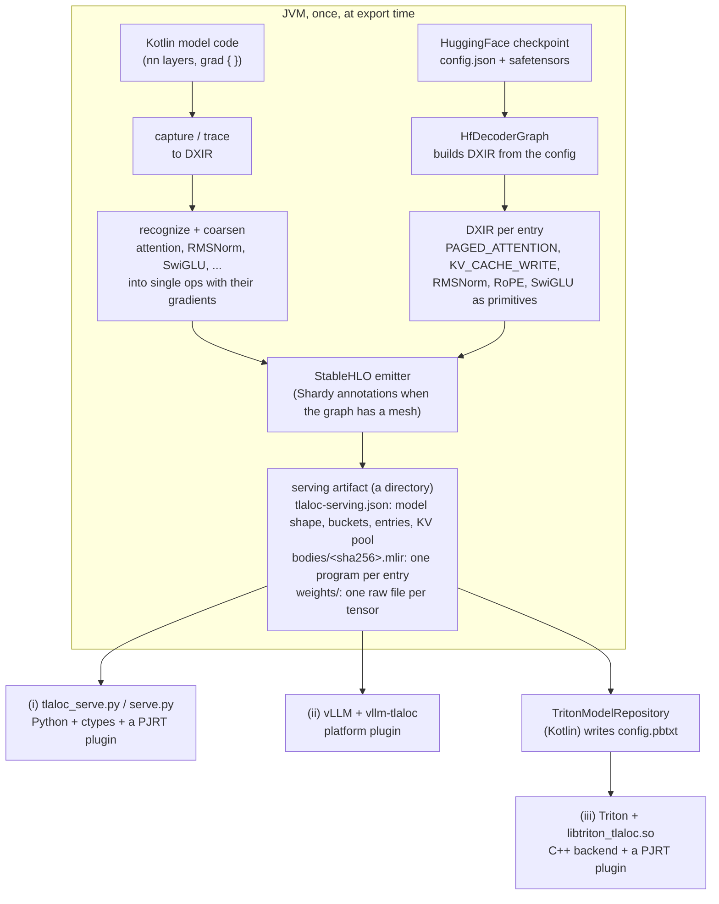

# How serving works in Tlaloc

Kotlin turns a model into a directory of StableHLO programs and weight files,
then exits. Something else runs that directory: a Python process with no
framework in it, vLLM, or NVIDIA Triton. None of the three calls back into
the JVM.

This page describes the path from a model to a running server, what each of
the three servers is for, which process does what, where the memory lives,
and what has run on which hardware. The commands are in
[SERVING_RUNBOOK.md](SERVING_RUNBOOK.md) and [triton/README.md](../triton/README.md);
[examples/triton-llm](../examples/triton-llm/) runs the whole path in one script.



## 1. From a model to DXIR

DXIR is Tlaloc's graph IR: typed tensors, one `OpKind` per node. Two routes
lead into it.

**A HuggingFace checkpoint.** `HfDecoderGraph` (in `:ir`) reads the
checkpoint's `config.json` through an `HfModelFamily` (Llama, Qwen3, Muse
Glimmer) and builds the decoder directly with `DxirBuilder`, one graph per
compiled entry:

```
embed → [rms_norm]
per layer: rms_norm → q/k/v → [q/k rms_norm] → [RoPE] → KV_CACHE_WRITE ×2
           → PAGED_ATTENTION (full or sliding window) → [× sigmoid(gate)] → o_proj → +residual
           → rms_norm → SwiGLU → down_proj → +residual
final rms_norm → lm_head → [soft-cap] → logits
```

Paged attention and the KV cache write are ops of their own
(`OpKind.PAGED_ATTENTION`, `OpKind.KV_CACHE_WRITE`). They are inference-only:
both reverse-mode and forward-mode AD refuse them by name. RMSNorm, RoPE and
SwiGLU are written out as primitive arithmetic (reduce, rsqrt, multiply,
logistic, slices). The steps in brackets are switched on per layer by the
family.

A graph is either a **decode** entry (one new token per sequence, batch `B`)
or a **prefill** entry (a chunk of up to `context` tokens of one sequence, in
one call). Both return the logits of each sequence's last token.

**Kotlin model code.** A model written with the `nn` layers, or a function
under `grad { }`, is captured or traced into DXIR. The recognizers then find
known shapes in the traced graph (attention as `MATMUL → SOFTMAX → MATMUL`,
RMSNorm, LayerNorm, SwiGLU, the transformer MLP) and the coarseners replace
each with one `COARSENED` op that carries both its forward body and an
analytical gradient body. [examples/internals/layer3](../examples/internals/layer3/)
shows this step. This route is how Tlaloc trains
([examples/gpu-training](../examples/gpu-training/)). No serving artifact is
written from it today: every serving artifact comes from a graph builder
(`HfDecoderGraph`, or `ReferenceDecodeGraph` for the small test model).

## 2. From DXIR to StableHLO

The StableHLO emitter (`:stablehlo`) writes each graph as textual StableHLO,
one module per entry, with the entry function named `main`:

- `PAGED_ATTENTION` lowers to `gather` over the pages the block table names,
  two `dot_general`s at HIGHEST precision (so XLA does not run them in TF32)
  and a masked softmax.
- `KV_CACHE_WRITE` lowers to `scatter` into the pool at the token's slot.
- bf16 weights (Muse Glimmer) stay bf16: each projection rounds its f32 input
  to bf16 and multiplies bf16 by bf16 into f32.

When a graph declares a device mesh, the emitter also writes Shardy (`sdy`)
mesh and sharding annotations. Serving artifacts are single-device, so their
bodies contain none. Tlaloc serving on more than one device has not been
built.

## 3. The serving artifact

`HfServingExport.export` (in `:maestro`) writes the artifact:

```
<artifact>/
  tlaloc-serving.json      the manifest (schema tlaloc-serving-v2)
  bodies/<sha256>.mlir     one StableHLO module per entry, named by its hash
  programs/<entry>.json    each entry's inputs and outputs
  weights/NNNN_<slot>.bin  one raw little-endian file per weight tensor
```

The manifest records:

- **the model shape**: layers, heads, KV heads, head size, vocabulary, and
  the KV pool: `numBlocks` pages of `blockSize` tokens per layer, for K and
  for V;
- **the buckets**: a batch ladder and a context ladder. Each (batch, context)
  point is one decode entry; each context also gets a prefill entry at batch
  1. A server runs a request on the smallest entry that holds it and pads the
  rest;
- **the entries**: kind, batch, context, body path and hash, and the
  signature with a role per input (`TOKEN_IDS`, `POSITIONS`, `BLOCK_TABLES`,
  `SEQ_LENS`, `SLOT_MAPPING`, `KV_POOL_IN`, weight slots) and output
  (`LOGITS`, `KV_POOL_OUT`);
- **the weight table**: slot name, dtype, shape and byte length of each file;
- **the donation pairs**: each `KV_POOL_OUT` output with the `KV_POOL_IN`
  input it replaces. The body says the same thing to XLA: each paired
  parameter of `@main` carries `tf.aliasing_output = <output index>`, so a
  runtime that donates the pool buffers gets each updated pool written in
  place, in the memory of the pool it read.

The weights are read from the checkpoint's safetensors and written as raw
files with no header: the file is the operand. Linears are transposed from
HuggingFace's `[out, in]` to `[in, out]` on the way. The artifact has no
tokenizer; its `modelName` is the HuggingFace repo id, which is how a
frontend finds the tokenizer.

Every body is checked against its signature at export time. The export needs
no GPU and loads no PJRT plugin.

## 4. Three ways to serve it

All three compile the StableHLO with a PJRT plugin (the XLA CUDA plugin,
`xla_cuda_plugin.so`) and create the PJRT client with a memory fraction and
preallocation off. Without those options the XLA plugin reserves 75% of GPU
memory, which on a GB10 is 75% of the machine's RAM.

| | (i) Python, no framework | (ii) vLLM | (iii) Triton |
|---|---|---|---|
| What it is for | Proving the artifact is the deployment: the smallest process that can run it | Putting a Tlaloc model under vLLM's scheduler, block manager and tokenizer | Serving over HTTP and gRPC with Triton's batching, sequence handling and metrics |
| Process | one Python process: `tlaloc_serve.py` and `tlaloc_pjrt.py` (ctypes) load the plugin `.so` | vLLM's engine and worker processes; `vllm-tlaloc` replaces the model runner | `tritonserver` in the Triton container; `libtriton_tlaloc.so` loads the plugin `.so` |
| Python packages in the serving process | none beyond the standard library | vLLM and torch (vLLM's own); no torch model is built | none: the backend is C++ |
| Weights | uploaded once, on the device | uploaded once, on the device | uploaded once per GPU at model load, on the device |
| KV pages | the caller allocates pages | vLLM's block manager allocates them | the backend allocates them per sequence (correlation ID) and frees them on END, or, when pages run short, after twice the idle timeout plus a queueing allowance |
| KV pools between steps | copied to the host and back every step | as in (i) | on the device, updated in place: each execution is handed the pools and writes them where they are |
| Prompt | one decode step per token | one decode step per token (chunked prefill refused by name) | one prefill call |
| Batching | the caller builds the batch | vLLM's scheduler | decode steps of different sequences in one call (Triton's sequence batcher, oldest strategy) |
| Sampling | greedy, host-side | vLLM's sampler over the returned logits | the client's; the server returns logits |

### (i) Framework-free Python

`harness/python/tlaloc_serve.py` reads the manifest, compiles entries through
`tlaloc_pjrt.py` (ctypes over the PJRT C API), uploads the weights once and
runs decode steps. It imports no jax, no torch and no numpy; a test runs it
with an import guard that raises on those modules.
[examples/gpu-inference/serve.py](../examples/gpu-inference/) is the
runnable form. It is a correctness path, not a throughput one: the KV pools
cross to the host as Python lists every step, which is why a TinyLlama step
takes about 1.35 s. The pool aliases in the bodies do not help here: the
pools are uploaded fresh every step, so there is no device pool to keep.

### (ii) vLLM platform plugin

`harness/python/vllm_tlaloc` registers a vLLM platform (`TlalocPlatform`) and a
worker. vLLM keeps its scheduler, its paged block manager, tokenizer and
detokenizer; the worker runs the artifact's decode entries through
`tlaloc_serve.py` and never builds a torch model. `--block-size` must equal
the artifact's `blockSize` and `--max-model-len` must lie on its context
ladder; the plugin refuses anything else by name, because a different block
size is a different compiled program.

### (iii) Triton backend

`TritonModelRepository.write(artifactDir, repositoryDir, name)` (or
`:maestro:exportTritonModel`) turns the artifact into a Triton model: a
`config.pbtxt` and a version directory holding the artifact's files. In
sequence mode the configuration has one input `TOKENS` (INT32 `[1, n]`), one
output `LOGITS` (FP32 `[1, vocab]`), the START/END/CORRID controls and the
`serving_manifest` parameter.

At load the backend reads the manifest, checks every body's signature,
compiles every entry and uploads the weights. Per request:

- a client sends the prompt with START; the backend runs it on the smallest
  prefill entry that holds it, as one call;
- each later request carries one token; the one-token requests of different
  sequences that Triton hands over together run as one decode call on the
  smallest entry that holds them;
- the backend derives each sequence's block table and slots from the pages it
  holds; the client sends token ids only;
- the KV pools are donated to each execution, and XLA writes the updated
  pools over them (the alias in the body): the pools stay at the device
  addresses they were given at load and no execution copies them. The
  backend checks the addresses after every run and logs the result;
  `verify.sh` requires 100 of 100 runs in place, and a control served with
  the model parameter `donate_kv_pools` set to `false` must show 100 of 100
  copied, with the same ids.

The backend also serves any Tlaloc StableHLO that is not a language model:
`config.pbtxt` parameters `arguments` and `results` bind each argument to an
input, a weight file or a piece of per-instance state. Stateless models can
use Triton's dynamic batcher, tensors in CUDA shared memory are read in place
and outputs written device to device, and each GPU an instance group names
gets its own PJRT client. Details and limits: [triton/README.md](../triton/README.md).

## 5. What has run, and where

All of it ran on one machine: an NVIDIA GB10 (aarch64, one GPU whose memory
is the system RAM), driver 580.126.09.

| | Status | What certifies it |
|---|---|---|
| Export of TinyLlama-1.1B and Qwen3-0.6B | ✅ | the reference interpreter runs the exported graphs and matches HuggingFace transformers' greedy ids (`HfQwen3RealParityTest` and the TinyLlama tests); a prefill chunk equals the decode loop bit for bit |
| Export of Muse Glimmer 30B (text decoder, bf16 weights) | ✅ GB10 | certified by serving it through Triton (below); the full model is too large for the interpreter tests, which run a five-layer model with closed-form weights |
| (i) framework-free Python, TinyLlama | ✅ GB10 | 6 of 6 greedy ids equal HuggingFace's, from `/usr/bin/python3` with no jax, torch or numpy installed; the tests run the runtime under an import guard that raises on them |
| (ii) vLLM 0.29.0 `LLM.generate()`, TinyLlama | ✅ GB10 | 6 of 6 ids equal the direct driver and HuggingFace |
| (ii) `vllm serve` (the HTTP server) | 🧪 | written, never started |
| (iii) Triton, TinyLlama-1.1B | ✅ GB10 | `triton/verify.sh`: HuggingFace's 6 ids over HTTP and gRPC; four concurrent sequences each equal their solo run; page exhaustion and idle timeout |
| (iii) Triton, Qwen3-0.6B | ✅ GB10 | `verify.sh`: 16 ids equal HuggingFace's for a plain and a chat-template prompt; about 19 ms a token |
| (iii) Triton, Muse Glimmer 30B text decoder, bf16 weights | ✅ GB10 | `verify.sh` with `MUSE_GLIMMER=1`: 32 ids equal transformers run with the same arithmetic; about 245 ms a token |
| (iii) Triton, dynamic batching, CUDA shared memory, nine dtypes | ✅ GB10 | `verify.sh` |
| (iii) Triton on GPUs other than 0 | 🧪 | written; the GB10 has one GPU |
| Any of the three on a TPU | 🧪 | the artifact is platform-neutral StableHLO; no TPU has run it ([TPU_BRINGUP.md](TPU_BRINGUP.md)) |
| A discrete GPU (PCIe, separate device memory) | not run | every measurement here is on unified memory |

The measured timings, and what they include, are in
[triton/README.md](../triton/README.md#measured-on-the-gb10) and
[SERVING_RUNBOOK.md](SERVING_RUNBOOK.md).
