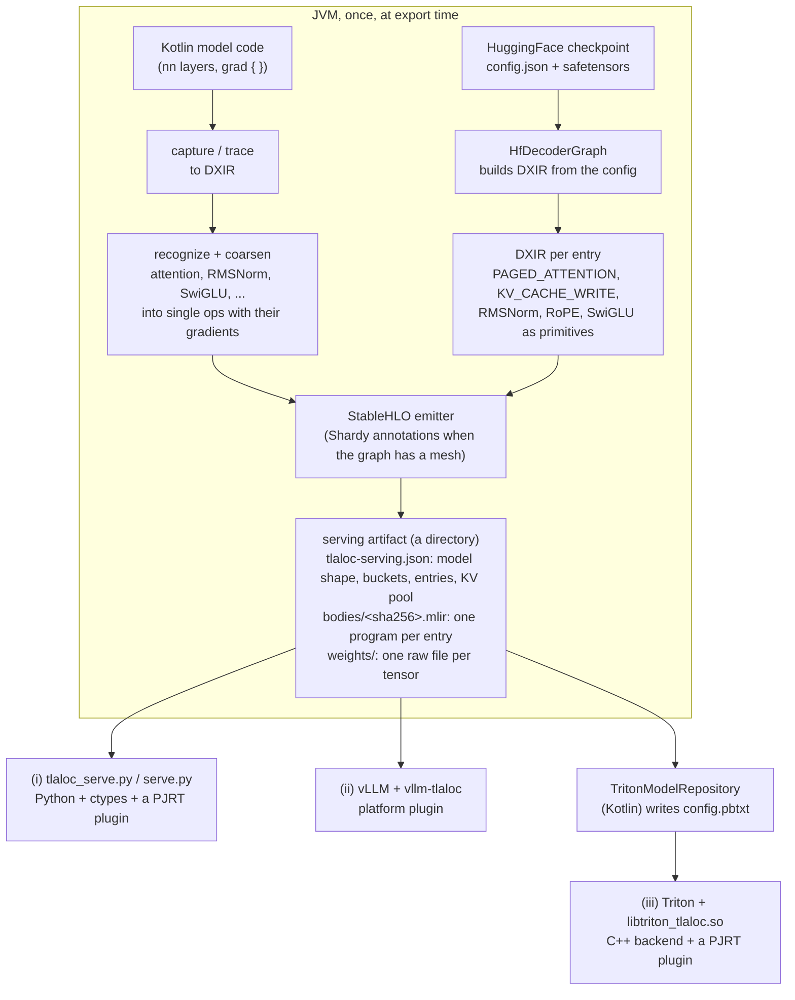

# How serving works in Tlaloc

Kotlin turns a model into a directory of StableHLO programs and weight files,
then exits. Something else runs that directory: a Python process with no
framework in it, vLLM, or NVIDIA Triton. None of the three calls back into
the JVM.

This page describes the path from a model to a running server, what each of
the three servers is for, which process does what, where the memory lives,
and what has run on which hardware. The commands are in
[SERVING_RUNBOOK.md](SERVING_RUNBOOK.md) and [triton/README.md](../triton/README.md);
[examples/triton-llm](../examples/triton-llm/) runs the whole path in one script.


```mermaid
flowchart TD
    subgraph kotlin["JVM, once, at export time"]
        A1["HuggingFace checkpoint<br/>config.json + safetensors"] --> B1["HfDecoderGraph<br/>builds DXIR from the config"]
        A2["Kotlin model code<br/>(nn layers, grad { })"] --> B2["capture / trace<br/>to DXIR"]
        B2 --> C2["recognize + coarsen<br/>attention, RMSNorm, SwiGLU, ...<br/>into single ops with their gradients"]
        B1 --> D["DXIR per entry<br/>PAGED_ATTENTION, KV_CACHE_WRITE,<br/>RMSNorm, RoPE, SwiGLU as primitives"]
        C2 --> E
        D --> E["StableHLO emitter<br/>(Shardy annotations when the graph has a mesh)"]
        E --> F["serving artifact (a directory)<br/>tlaloc-serving.json: model shape, buckets, entries, KV pool<br/>bodies/&lt;sha256&gt;.mlir: one program per entry<br/>weights/: one raw file per tensor"]
    end
    F --> G1["(i) tlaloc_serve.py / serve.py<br/>Python + ctypes + a PJRT plugin"]
    F --> G2["(ii) vLLM + vllm-tlaloc<br/>platform plugin"]
    F --> T["TritonModelRepository<br/>(Kotlin) writes config.pbtxt"]
    T --> G3["(iii) Triton + libtriton_tlaloc.so<br/>C++ backend + a PJRT plugin"]
```

## 1. From a model to DXIR

DXIR is Tlaloc's graph IR: typed tensors, one `OpKind` per node. Two routes
lead into it.

**A HuggingFace checkpoint.** `HfDecoderGraph` (in `:ir`) reads the
checkpoint's `config.json` through an `HfModelFamily` (Llama, Qwen3, Muse
Glimmer) and builds the decoder directly with `DxirBuilder`, one graph per
compiled entry:

```
embed → [rms_norm]
per layer: rms_norm → q/k/v → [q/k rms_norm] → [RoPE] → KV_CACHE_WRITE ×2
           → PAGED_ATTENTION (full or sliding window) → [× sigmoid(gate)] → o_proj → +residual
           → rms_norm → SwiGLU → down_proj → +residual
final rms_norm → lm_head → [soft-cap] → logits
```

A checkpoint that ties its head to the embedding table (Qwen3) gets no head
weight: `lm_head` is one `MATMUL` with explicit contracting dims (the hidden
axis of the final state and of the table, a `dot_general` with
`contracting_dims = [1] x [1]`), so the table is on the device once. In the
reference interpreter it gives the logits of a transposed copy bit for bit.

Paged attention and the KV cache write are ops of their own
(`OpKind.PAGED_ATTENTION`, `OpKind.KV_CACHE_WRITE`). They are inference-only:
both reverse-mode and forward-mode AD refuse them by name. RMSNorm, RoPE and
SwiGLU are written out as primitive arithmetic (reduce, rsqrt, multiply,
logistic, slices). The steps in brackets are switched on per layer by the
family.

A graph is either a **decode** entry (one new token per sequence, batch `B`)
or a **prefill** entry (a chunk of up to `context` tokens for each of `B`
sequences, in one call). Both return the logits of each sequence's last
token. In a prefill entry each sequence has its own row of the token axis,
right-aligned: padding tokens first (slot -1, so their KV is never written),
then the sequence's tokens, each with its own position. A token's causal
length is its position plus one, so a row never reads another row's tokens,
and a prompt prefilled together with others gets, in the reference
interpreter, the logits and KV it gets alone, bit for bit
(`BatchedPrefillTest`).

**Kotlin model code.** A model written with the `nn` layers, or a function
under `grad { }`, is captured or traced into DXIR. The recognizers then find
known shapes in the traced graph (attention as `MATMUL → SOFTMAX → MATMUL`,
RMSNorm, LayerNorm, SwiGLU, the transformer MLP) and the coarseners replace
each with one `COARSENED` op that carries both its forward body and an
analytical gradient body. [examples/internals/layer3](../examples/internals/layer3/)
shows this step. This route is how Tlaloc trains
([examples/gpu-training](../examples/gpu-training/)). No serving artifact is
written from it today: every serving artifact comes from a graph builder
(`HfDecoderGraph`, or `ReferenceDecodeGraph` for the small test model).

## 2. From DXIR to StableHLO

The StableHLO emitter (`:stablehlo`) writes each graph as textual StableHLO,
one module per entry, with the entry function named `main`:

- `PAGED_ATTENTION` lowers to `gather` over the pages the block table names,
  two `dot_general`s in f32 (never TF32 or bf16) and a masked softmax. In a
  prefill body the tokens of one sequence share its block table, so its
  pages are gathered once and every token attends over them with its own
  causal length; gathering them once per token would take
  `tokens x context` keys and values per layer (8 GiB per layer for Muse
  Glimmer at 2,048 tokens and context 2,048). Decode dots ask for
  `precision = HIGHEST`; prefill dots name the f32 dot algorithm (f32
  operands, products and sums), which XLA runs as its own f32 GEMM, about
  1.3 times faster than the cuBLAS SIMT kernel it picks for HIGHEST on the
  GB10.
- **Blockwise attention.** When the tokens of a prefill call share a table
  and its context spans several key blocks of 2,048 positions, the lowering
  is a `stablehlo.while` over the key blocks instead: each iteration slices
  2,048 keys and values, scores them, and folds them into a running max, a
  running sum and a running P.V (the online softmax), so no score tensor as
  wide as the context is written. The loop runs from the first block any
  row can see to the block holding the call's last position, so a call
  early in a large bucket scores only the positions its sequence has. In
  f32 the result differs from the one-pass form only in the order of the
  sums: on the GB10 it agrees with the interpreter's walk within 6e-8
  (`PjrtBlockwisePagedAttentionTest`).
- A sliding layer whose table is a ring (`ring = true`, section 3) scores
  only the ring, masking each ring slot by its age: the slot at index `i`
  holds the position `(L - 1 - i) mod N` behind the row's last one, live
  when that is less than the window and less than `L`.
- `KV_CACHE_WRITE` lowers to `scatter` into the pool at the token's slot.
- bf16 weights (Muse Glimmer by default, Llama and Qwen3 with
  `-PweightDType=bf16`) stay bf16: each projection rounds its f32 input to
  bf16 and multiplies bf16 by bf16 into f32.

When a graph declares a device mesh, the emitter also writes Shardy (`sdy`)
mesh and sharding annotations. Serving artifacts are single-device, so their
bodies contain none. Tlaloc serving on more than one device has not been
built.

## 3. The serving artifact

`HfServingExport.export` (in `:maestro`) writes the artifact:

```
<artifact>/
  tlaloc-serving.json      the manifest (tlaloc-serving-v2, or v3 with a windowed KV pool)
  bodies/<sha256>.mlir     one StableHLO module per entry, named by its hash
  programs/<entry>.json    each entry's inputs and outputs
  weights/NNNN_<slot>.bin  one raw little-endian file per weight tensor
```

The manifest records:

- **the model shape**: layers, heads, KV heads, head size, vocabulary, and
  the KV pool: `numBlocks` pages of `blockSize` tokens per layer, for K and
  for V; for a model with sliding-window layers, the **windowed KV pool**
  (below): its window, its layers, its pages and its ring size;
- **the buckets**: a batch ladder and a context ladder. Each (batch, context)
  point is one decode entry and one prefill entry (`-PprefillMaxBatch`, or
  `HfServingExport.export(prefillMaxBatch = ...)`, caps the prefill batches;
  1 gives the batch-1 prefill entries alone). A server runs a request on the
  smallest entry that holds it and pads the rest. A prefill entry takes its
  whole context per call unless the export sets a chunk (`-PprefillChunk`,
  below); `-PcontextLadder=512,2048,8192` sets the context buckets;
- **the entries**: kind, batch, context, body path and hash, and the
  signature with a role per input (`TOKEN_IDS`, `POSITIONS`, `BLOCK_TABLES`,
  `SEQ_LENS`, `SLOT_MAPPING`, `KV_POOL_IN`, weight slots, and with a windowed
  pool `WINDOW_BLOCK_TABLES`, `WINDOW_SLOT_MAPPING`, `WINDOW_KV_POOL_IN`) and
  output (`LOGITS`, `KV_POOL_OUT`, `WINDOW_KV_POOL_OUT`);
- **the weight table**: slot name, dtype, shape and byte length of each file;
- **the refused tokens** (`model.refusedTokens`, when there are some): the
  ids of a multimodal checkpoint's image and video placeholders, with the
  config key naming each. The artifact is the text decoder only, and a
  server refuses a request holding one by name (the Triton backend and
  `tlaloc_serve.py` do);
- **the donation pairs**: each `KV_POOL_OUT` output with the `KV_POOL_IN`
  input it replaces. The body says the same thing to XLA: each paired
  parameter of `@main` carries `tf.aliasing_output = <output index>`, so a
  runtime that donates the pool buffers gets each updated pool written in
  place, in the memory of the pool it read.

The weights are read from the checkpoint's safetensors and written as raw
files with no header: the file is the operand. Linears are transposed from
HuggingFace's `[out, in]` to `[in, out]` on the way. The artifact has no
tokenizer; its `modelName` is the HuggingFace repo id, which is how a
frontend finds the tokenizer.

Every body is checked against its signature at export time. The export needs
no GPU and loads no PJRT plugin.

### Sliding-window layers: the windowed KV pool

A sliding-window layer with window `W` reads, for the token at position `p`,
only the positions `p - W + 1 .. p`. Its older keys and values are never read
again, so keeping them is wasted memory. When a model has such layers (Muse
Glimmer: 39 of its 52 layers, window 2048), the export puts them in a second
pool class, the windowed KV pool, and writes a `tlaloc-serving-v3` manifest.
The full-attention layers keep full-history pages as before.

- Each sequence holds a **ring** of at most `ringPages` pages of the windowed
  pool. Logical block `b` of the sequence is on the ring's page
  `b % ringPages`, so position `p` is written over position
  `p - ringPages * blockSize`, which has left the window.
- The windowed layers get their own block table and slot mapping
  (`WINDOW_BLOCK_TABLES`, `WINDOW_SLOT_MAPPING`), as wide as the full ones:
  entry `b` is the ring page of block `b`, so the first `ringPages` entries
  are the ring. When the bucket is wider than the ring, the graph passes
  only those entries to `PAGED_ATTENTION` with `ring = true`: a sliding
  layer gathers and scores the ring's `ringPages * blockSize` positions
  (2,560 for Muse Glimmer), not the bucket's, and masks each by how far
  behind the row's last position it is. The positions in the window are
  all still in the ring (below).
- A ring of `ceil(W / blockSize)` pages holds one window, and a decode step
  needs no more; the default is one page more. A call that writes `n` tokens
  starting at `p0` needs `min(p0, W - 1) + n` positions at once, so a runtime
  splits a longer request into calls of at most
  `ringPages * blockSize - min(p0, W - 1)` tokens. With the spare page every
  call can write at least `blockSize + 1` tokens.
- The ring is capped at the pages of the largest context, where it never
  wraps. The windowed pool's page budget defaults to as many rings as the
  full pool holds sequences of the largest context, capped at the full
  pool's pages.

KV bytes per sequence for Muse Glimmer (f32 keys and values, 2 KV heads of
128, pages of 16 tokens: 32 KiB per page per layer; ring of 129 pages),
computed from that geometry:

| Positions | Full history, 52 layers | Windowed pool for 39 layers | Ratio |
|---|---|---|---|
| 2,048 | 208 MiB | 208 MiB | 1.00 (128 pages, the ring has not filled) |
| 8,192 | 832 MiB | 365 MiB | 2.28 |
| 32,768 | 3,328 MiB | 989 MiB | 3.36 |

As the context grows the ratio approaches 52 / 13 = 4, because the 13
full-attention layers still grow with the sequence. The artifact `verify.sh`
serves reaches 32,768 positions with prefill calls of 512 tokens, so its ring
is 160 pages (below): its pools, room for four sequences of 32,768 positions,
take 4,109 MiB on the device, where full-history pages for the same four
would take 13,312 MiB.

### Long contexts: prefill in chunks

Each token of a prefill call attends over the call's context, masked to its
own causal length, so the call's attention work grows with tokens times
context: one 512-token call at context 32,768 in Muse Glimmer scores 512
tokens x 32 heads x 32,768 positions in each full-attention layer, and a
call that took all 32,768 tokens would score 64 times as many. The emitter never writes those scores at once: a
context of several key blocks is attended one block of 2,048 keys at a time
(below, "Blockwise attention"), so the largest Muse Glimmer entry needs
453 MiB of temporary memory instead of 4,125 MiB. With
`-PprefillChunk=N` (`HfServingExport.export(prefillChunk = N)`) a prefill
entry takes at most `N` tokens per sequence (`tokensPerSeq` in the
manifest), and a runtime prefills a longer prompt in several calls, each on
the smallest entry whose context holds the call's last position. The
windowed ring is sized so that an `N`-token call fits past the window:
`ceil((window - 1 + N) / blockSize)` pages (160 for Muse Glimmer with
`N = 512`, against 129). In the reference interpreter chunked prefill gives
the logits of whole-context prefill bit for bit, with full-history and
windowed pools, and the same chunks through a ring one page too short change
them (`BatchedPrefillTest`); through Triton a windowed model with 6-token
chunks matches the full-history model sent the same calls (5 of 40 requests
bit for bit, the rest within 9.9e-7 of the largest logit; the windowed
model's sliding layers score a 16-position ring where the full-history
model's score 64 positions, so the GPU sums in another order).

Muse Glimmer exported with contexts 512, 2,048, 8,192 and 32,768, decode
batches 1, 2 and 4, batch-1 prefill in chunks of 512, and a full pool of
8,193 pages (four sequences of 32,768 positions), served by Triton on the
GB10 (`triton/context_bench.py`, gRPC; prompts of seeded random ids, four
sequences per context; decode medians over 16 steps per sequence). This
table was measured while another process shared the GPU, and before sliding
layers read their ring and prefill attended block by block; section 6 has
the same model before and after that change on an idle GPU (a 31,744-token
prompt in 62.6 s instead of 222.8 s):

| Context bucket | Prompt | Prefill | 1 sequence | 2 sequences | 4 sequences |
|---|---|---|---|---|---|
| 512 | 432 tokens | 0.56 s (766 tokens/s) | 265 ms a token | 267 ms a step, 7.5 tokens/s | 238 ms a step, 16.7 tokens/s |
| 2,048 | 1,968 | 2.6 s (751 tokens/s) | 268 ms | 272 ms, 7.3 tokens/s | 248 ms, 16.0 tokens/s |
| 8,192 | 8,112 | 17.0 s (476 tokens/s) | 275 ms | 286 ms, 7.0 tokens/s | 279 ms, 14.3 tokens/s |
| 32,768 | 32,688 | 230 s (142 tokens/s) | 317 ms | 352 ms, 5.7 tokens/s | 416 ms, 9.6 tokens/s |

- Decode is bound by reading the 52 GiB of weights, so up to 8,192
  positions four sequences cost about what one does. At 32,768 attention
  showed: each step gathered and scored every position of the bucket, for
  the sliding layers too (masked outside the window).
- Prefill slowed with the bucket for the same reason: every 512-token call
  scored its tokens against the whole context of its entry, about 0.55 s at
  context 512 and about 4.5 s at 32,768. A 32,768-token prompt takes 64 calls.
- The 16 compiles took 2 minutes at load and the weights 90 s. XLA reported
  4.0 GiB of temporary memory for the largest entry (prefill at 32,768),
  453 MiB since prefill attends block by block; the KV pools are 4.0 GiB. Under a PJRT memory fraction of 0.55 the machine
  peaked at 87 to 90 GiB in use, about 9 GiB of it other processes.
- Four sequences stepping together ran as one execution per step only with
  the sequence batcher's queue delay at 20 ms (`-PmaxQueueDelayMicros=20000`):
  with the default 1 ms, clients that each receive an 800 KB logits vector
  sent their next steps more than 1 ms apart, and two sequences ran 32 steps
  in 31 executions, four ran 64 in 35. The delay costs a lone sequence about
  24 ms a token (241 ms against 265 ms).
- Sliding layers now score only their ring (section 2). A paged kernel that
  does not gather at all is not started (⬜).

The two framework-free runtimes, (i) and (ii) below, read `v1` and `v2`
artifacts and refuse a `v3` one by its schema version; only the Triton
backend fills a windowed pool. Export with `-PwindowedKv=false` for an
artifact they can read.

## 4. Three ways to serve it

All three compile the StableHLO with a PJRT plugin (the XLA CUDA plugin,
`xla_cuda_plugin.so`) and create the PJRT client with a memory fraction and
preallocation off. Without those options the XLA plugin reserves 75% of GPU
memory, which on a GB10 is 75% of the machine's RAM.

| | (i) Python, no framework | (ii) vLLM | (iii) Triton |
|---|---|---|---|
| What it is for | Proving the artifact is the deployment: the smallest process that can run it | Putting a Tlaloc model under vLLM's scheduler, block manager and tokenizer | Serving over HTTP and gRPC with Triton's batching, sequence handling and metrics |
| Process | one Python process: `tlaloc_serve.py` and `tlaloc_pjrt.py` (ctypes) load the plugin `.so` | vLLM's engine and worker processes; `vllm-tlaloc` replaces the model runner | `tritonserver` in the Triton container; `libtriton_tlaloc.so` loads the plugin `.so` |
| Python packages in the serving process | none beyond the standard library | vLLM and torch (vLLM's own); no torch model is built | none: the backend is C++ |
| Weights | uploaded once, on the device | uploaded once, on the device | uploaded once per GPU at model load, on the device |
| KV pages | the caller allocates pages | vLLM's block manager allocates them | the backend allocates them per sequence (correlation ID) and frees them on END; when pages run short it reclaims them from sequences idle past twice the timeout plus a queueing allowance (which Triton has ended), least recently active first, and otherwise refuses the request by name, the sequence keeping its KV; a sliding-window layer's pages are a ring per sequence, bounded by the window |
| KV pools between steps | copied to the host and back every step | as in (i) | on the device, updated in place: each execution is handed the pools and writes them where they are |
| Prompt | one prefill call (`run_prefill`) when the artifact has an entry that holds it, else one decode step per token | as in (i), for all but the prompt's last token (chunked prefill refused by name) | one prefill call; the prompts of sequences started together in one call |
| Batching | the caller builds the batch | vLLM's scheduler | decode steps of different sequences in one call, and prompts of different sequences in one prefill call (Triton's sequence batcher, oldest strategy) |
| Sampling | greedy, host-side | vLLM's sampler over the returned logits | the client's; the server returns logits |

### (i) Framework-free Python

`harness/python/tlaloc_serve.py` reads the manifest, compiles entries through
`tlaloc_pjrt.py` (ctypes over the PJRT C API), uploads the weights once and
runs prefill calls (`run_prefill`: a chunk per sequence, right-aligned in its
row, one call) and decode steps (`run_decode`). It imports no jax, no torch and no numpy; a test runs it
with an import guard that raises on those modules.
[examples/gpu-inference/serve.py](../examples/gpu-inference/) is the
runnable form. It is a correctness path, not a throughput one: the KV pools
cross to the host as Python lists every step, which is why a TinyLlama step
takes about 1.35 s. The pool aliases in the bodies do not help here: the
pools are uploaded fresh every step, so there is no device pool to keep.

### (ii) vLLM platform plugin

`harness/python/vllm_tlaloc` registers a vLLM platform (`TlalocPlatform`) and a
worker. vLLM keeps its scheduler, its paged block manager, tokenizer and
detokenizer; the worker runs the artifact's entries through `tlaloc_serve.py` (a new
sequence's prompt, but its last token, as one prefill call when the artifact
has an entry that holds it) and never builds a torch model. `--block-size` must equal
the artifact's `blockSize` and `--max-model-len` must lie on its context
ladder; the plugin refuses anything else by name, because a different block
size is a different compiled program.

### (iii) Triton backend

`TritonModelRepository.write(artifactDir, repositoryDir, name)` (or
`:maestro:exportTritonModel`) turns the artifact into a Triton model: a
`config.pbtxt` and a version directory holding the artifact's files. In
sequence mode the configuration has one input `TOKENS` (INT32 `[1, n]`), the
output `LOGITS` (FP32 `[1, vocab]`), the optional output `KV_PAGES` (INT32
`[2]`: the pages the sequence holds in the full-history and the windowed
pools, returned when a client asks for it), the START/END/CORRID controls and
the `serving_manifest` parameter.

At load the backend reads the manifest, checks every body's signature,
compiles every entry and uploads the weights. Per request:

- a client sends the prompt with START; the backend runs it on the smallest
  prefill entry that holds it, as one call. The prompts that Triton hands
  over together (several clients starting sequences at once) run as one
  call when they fall in one context bucket, on the smallest prefill entry
  whose batch holds them; prompts of different context buckets are not
  merged, because a call computes every row at its entry's context;
- each later request carries one token; the one-token requests of different
  sequences that Triton hands over together run as one decode call on the
  smallest entry that holds them;
- the backend derives each sequence's block table and slots from the pages it
  holds; the client sends token ids only;
- when pages run short, the backend reclaims them only from sequences Triton
  has already ended (idle past the rule; a request the backend refuses still
  counts as activity, as it does for Triton), least recently active first and
  only as many as needed; otherwise it refuses the request by name, listing
  the sequences that hold pages, and a sequence refused mid-generation keeps
  its pages and KV so the same request can be sent again. A live sequence is
  never preempted: swapping its KV out, or dropping it and recomputing it
  later, is not built (📐);
- a token id the manifest lists as a placeholder is refused by name, and the
  sequence is left as it was;
- with a windowed KV pool the backend also keeps each sequence's ring of
  windowed pages, fills the window block table and slots from it, and splits
  a request into calls the ring can hold (each through the smallest prefill
  entry that covers it);
- the KV pools are donated to each execution, and XLA writes the updated
  pools over them (the alias in the body): the pools stay at the device
  addresses they were given at load and no execution copies them. The
  backend checks the addresses after every run and logs the result;
  `verify.sh` requires 100 of 100 runs in place, and a control served with
  the model parameter `donate_kv_pools` set to `false` must show 100 of 100
  copied, with the same ids.

The backend also serves any Tlaloc StableHLO that is not a language model:
`config.pbtxt` parameters `arguments` and `results` bind each argument to an
input, a weight file or a piece of per-instance state. Stateless models can
use Triton's dynamic batcher (the backend groups a batch's requests by the
shape of their rows, so a ragged batch of two widths runs as two
executions), tensors in CUDA shared memory are read in place
and outputs written device to device, and each GPU an instance group names
gets its own PJRT client. Details and limits: [triton/README.md](../triton/README.md).

## 5. What has run, and where

All of it ran on one machine: an NVIDIA GB10 (aarch64, one GPU whose memory
is the system RAM), driver 580.126.09.

| | Status | What certifies it |
|---|---|---|
| Export of TinyLlama-1.1B and Qwen3-0.6B | ✅ | the reference interpreter runs the exported graphs and matches HuggingFace transformers' greedy ids (`HfQwen3RealParityTest` and the TinyLlama tests); a prefill chunk equals the decode loop bit for bit |
| Export of Muse Glimmer 30B (text decoder, bf16 weights) | ✅ GB10 | certified by serving it through Triton (below); the full model is too large for the interpreter tests, which run a five-layer model with closed-form weights |
| (i) framework-free Python, TinyLlama | ✅ GB10 | 6 of 6 greedy ids equal HuggingFace's, from `/usr/bin/python3` with no jax, torch or numpy installed; the tests run the runtime under an import guard that raises on them |
| (ii) vLLM 0.29.0 `LLM.generate()`, TinyLlama | ✅ GB10 | 6 of 6 ids equal the direct driver and HuggingFace |
| (ii) `vllm serve` (the HTTP server) | 🧪 | written, never started |
| (iii) Triton, TinyLlama-1.1B | ✅ GB10 | `triton/verify.sh`: HuggingFace's 6 ids over HTTP and gRPC; four concurrent sequences each equal their solo run; page exhaustion and idle timeout |
| (i) framework-free Python, a prompt as one prefill call | ✅ GB10 | `HfLlamaServingArtifactTest`: TinyLlama's 6-token prompt runs as one call of `prefill_b1_c64` and the 6 ids equal HuggingFace's; the vLLM lane on the same artifact (whose runner writes the prompt with one prefill call) gives the same ids |
| (iii) Triton, Qwen3-0.6B | ✅ GB10 | `verify.sh`: 16 ids equal HuggingFace's for a plain and a chat-template prompt, the plain one also sent as text; the tied head reads the embedding table (310 weights, 2273 MiB, against 2867 MiB with a copy); about 15 ms a token |
| (iii) Triton, Qwen3-0.6B with bf16 weights | ✅ GB10 | `verify.sh`: 1136 MiB on the device (half), all 32 ids equal HuggingFace's, logits within 3.0e-3 of the largest (6e-3 required; at the f32 artifact's 2e-3 the check fails, so it tells bf16 weights from f32 ones); about 11 ms a token |
| (iii) Triton, a full page pool | ✅ GB10 | `verify.sh` (TinyLlama): a live sequence that needs a page when 21 sequences hold the pool is refused by name, nothing is reclaimed from live sequences, and after another sequence ends the same request succeeds and the sequence's ids equal its solo run's; abandoned sequences' pages are reclaimed least recently active first, only as many as needed (read from the server log); a sequence whose requests are being refused is not reclaimed (Triton counts them as activity), and a refused second START does not leave the earlier sequence's KV to be continued; both checks failed against the backend before these rules |
| (iii) Triton, preemption of live sequences (KV swap or recompute) | 📐 | not built |
| (iii) Triton, image and video placeholder ids refused | ✅ GB10 | `verify.sh`: the window models' stand-in ids are refused by name in a START and mid-sequence, the sequence unchanged; Muse Glimmer's 200091 and 200092 with `MUSE_GLIMMER=1` |
| (iii) Triton, Muse Glimmer 30B text decoder, bf16 weights | ✅ GB10 | `verify.sh` with `MUSE_GLIMMER=1`: 32 ids equal transformers run with the same arithmetic, served from a v3 artifact whose 39 sliding layers are in the windowed pool; about 265 ms a token (241 ms with the batcher's 1 ms queue delay) |
| (iii) Triton, Muse Glimmer at contexts up to 32,768 and four sequences, prefill in 512-token calls | ✅ GB10 | `verify.sh` with `MUSE_GLIMMER=1`: a 2,305-token prompt whose fact lies 2,190 tokens before the question (outside the sliding window) gives the 16 ids transformers gives with the same arithmetic, logits within 7.7e-3 of the largest; the short prompts keep their 32 ids. Timings from `context_bench.py` in the table above |
| (iii) Triton, prefill in chunks shorter than the context | ✅ GB10 | `verify.sh`: `window_sequence_chunked` (6-token prefill calls, rings of 4 pages) matches the full-history model sent the same calls (5 of 40 requests bit for bit, the rest within 9.9e-7); the reference interpreter gives whole-context logits bit for bit, and chunks through a ring one page short change them |
| (iii) Triton, windowed KV pool for sliding-window layers | ✅ GB10 | `verify.sh`: a three-layer decoder with random weights (window 8, pages of 4, rings of 3 pages) grown to 60 positions holds at most 3 windowed pages while its full pages reach 15, and its logits equal the same model with full-history pages sent the same calls (worst 5.3e-7 of the largest logit), over HTTP and gRPC, alone and batched; the reference interpreter gives bit-identical logits for the two layouts over several windows, and a ring one page short or a call one token too long changes them |
| (iii) Triton, prompts of several sequences prefilled in one call | ✅ GB10 | `verify.sh`: 2 and 4 TinyLlama and Qwen3-0.6B prompts sent together run in one call of a batch-2 or batch-4 prefill entry and give their solo argmax and the same 8 greedy ids as alone, over HTTP and gRPC (logits within 5e-3 of the largest; the batched entry is a different executable under TF32); the reference interpreter gives the solo logits and the solo continuation bit for bit, with full-history and windowed pools, and padding that writes its KV or a left-aligned row changes them |
| (iii) Triton, dynamic batching, CUDA shared memory, nine dtypes | ✅ GB10 | `verify.sh`; a ragged batch is grouped by the shape of its rows: 216 requests of two widths ran in 74 to 76 executions against 119 to 134 when only consecutive requests of one width run together (the `group_by_shape` false control), with every request's rows identical |
| (iii) Triton on GPUs other than 0 | 🧪 | written; the GB10 has one GPU |
| Any of the three on a TPU | 🧪 | the artifact is platform-neutral StableHLO; no TPU has run it ([TPU_BRINGUP.md](TPU_BRINGUP.md)) |
| A discrete GPU (PCIe, separate device memory) | not run | every measurement here is on unified memory |

The measured timings, and what they include, are in
[triton/README.md](../triton/README.md#measured-on-the-gb10) and
[SERVING_RUNBOOK.md](SERVING_RUNBOOK.md).

## 6. Where the time goes

Measured through Triton on the GB10 with `triton/profile.sh`. The GPU was
otherwise idle: nvidia-smi read a median of 0% over 10 s before loading and
again before timing, and no other container was running. The context table
in section 3 was measured while another process kept the GPU busy. Times are
per request of one sequence over gRPC, medians of three runs. The kernel
breakdown comes from one Nsight Systems capture per workload (the server
under `nsys launch`), with each kernel tied to its HLO instruction through
XLA's dump (`profile_report.py`).

What the machine can do, measured with a CUDA program on the same GPU: a
kernel streams memory at 233 GB/s (the nominal LPDDR5X rate is 273 GB/s),
and cuBLAS multiplies 512x6656 by 6656x19968 at 70 TFLOPS in bf16 on tensor
cores, 33 TFLOPS in TF32 and 19 TFLOPS in plain f32.

### Decode, one sequence

A step reads every weight once, except an untied embedding table, of which
it reads one row. The floor is those bytes at 273 GB/s and at 233 GB/s.

| Model, weights | Bytes a step reads | Floor 273 / 233 GB/s | Kernels | Server | Client |
|---|---|---|---|---|---|
| TinyLlama-1.1B, f32 | 4.14 GB | 15.2 / 17.8 ms | 18.3 ms (444 kernels) | 20.5 ms | 22.9 ms |
| Qwen3-0.6B, f32 | 2.38 GB | 8.7 / 10.2 ms | 11.4 ms (621) | 13.9 ms | 17.1 ms |
| Qwen3-0.6B, bf16 | 1.19 GB | 4.4 / 5.1 ms | 6.7 ms (648) | 8.6 ms | 11.3 ms |
| Muse Glimmer, bf16, context 512 | 53.0 GB | 194 / 228 ms | 243 ms (1,569) | 246 ms | 268 ms |
| Muse Glimmer, bf16, context 8,192 | 53.0 GB | 194 / 228 ms | 251 ms (1,621) | 255 ms | 277 ms |

"Server" is Triton's compute time for the request: the backend builds the
inputs, runs the program and copies the logits back. "Client" adds the
queue and the gRPC round trip.

- Each step is one CUDA graph with no gaps between its kernels. The kernels
  that read weights take 88% (Qwen3 bf16) to 99% (Muse Glimmer) of kernel
  time. Muse Glimmer's MLP and head run at 217 to 237 GB/s and its attention
  projections at 176 to 222; TinyLlama's projections at 227 to 236 and
  Qwen3's f32 ones at 213 to 231. These are at or near the 233 GB/s
  ceiling. Qwen3's bf16 projections are not: its query projection runs at
  132 GB/s.
- The bf16 weights are read as bf16. In a decode step the convert to f32 is
  inside the matmul kernel (a Triton gemm fusion), and no weight is
  converted into a buffer of its own.
- Outside the kernels, per step: the sequence batcher's queue delay (1.2 ms
  for TinyLlama and Qwen3, whose configs wait up to 1 ms; 20.5 ms for Muse
  Glimmer, whose export waits up to 20 ms so that concurrent sequences
  batch). Then 0.8 to 3.7 ms from the first input copy to the first kernel.
  The backend uploads five to seven small integer inputs one at a time, and
  `cuGraphLaunch` alone takes 0.5 ms for Qwen3's graph and 1.35 ms for
  Muse Glimmer's. Last, 0.9 to 1.7 ms from the last kernel to the logits
  copy, because the backend waits for the execution to finish before it
  asks for the copy (these phases were read under the profiler).
- The attention of a step (page gathers, scores, softmax) is under 1% of
  kernel time at context 512 and 3% at 8,192 for Muse Glimmer. At 8,192 each
  sliding layer gathered all 512 pages of its block table, 8 MiB of f32 KV,
  although its ring holds at most 160 pages; it now reads the ring (next
  subsections).

### Muse Glimmer prefill, one 512-token call

Measured before sliding layers read their ring and before blockwise
attention (the next subsection has the numbers after):

| Context bucket | Client | Server | Kernels | Attention (scores, softmax, P.V) | Weight matmuls |
|---|---|---|---|---|---|
| 2,048 | 722 ms | 699 ms | 706 ms | 214 ms (30%) | 465 ms |
| 8,192 | 1,301 ms | 1,277 ms | 1,210 ms | 716 ms (59%) | 461 ms |
| 32,768 | 4,598 ms | 4,574 ms | 4,383 ms | 3,872 ms (88%) | 462 ms |

At 32,768:

| Component | Time | Share | What it is |
|---|---|---|---|
| Score and P.V dots | 2,000 ms | 46% | cuBLAS, f32 with `HIGHEST` precision (no tensor cores), 7 TFLOPS |
| Softmax and mask passes | 1,872 ms | 43% | three to four passes over a 2 GiB f32 score tensor per layer, at 243 GB/s |
| MLP (gate, up, down) | 360 ms | 8% | bf16 x bf16 into f32 on tensor cores, 56 to 61 TFLOPS |
| Attention projections | 91 ms | 2% | q, k, v fused at 36 TFLOPS; the gate and the output projection at 63 to 67 |
| The head, one row | 12 ms | 0.3% | 2.7 GB at 231 GB/s |
| Everything else | 48 ms | 1% | norms, RoPE, KV writes |

- Every layer, sliding or full, materializes a score tensor
  `f32[2, 8192, 32768]` (2 GiB) and a probability tensor of the same size,
  over every position of the bucket. The window is applied only as a mask on
  it, so a sliding layer does the work of a full one. XLA reports 4,125 MiB
  of temporary memory for this entry.
- The call costs the same wherever the sequence is in the bucket. A call at
  positions 8,704 to 9,215 scores 32,768 positions.
- The weight matmuls take about 460 ms at every bucket, at 80 to 95% of the
  bf16 tensor-core rate for the MLP and the gate and output projections.
- The attention dots read f32 K and V from f32 KV pools. Those are the only
  matmuls in the model that run in f32.

### Muse Glimmer prefill after rings and blockwise attention

Sliding layers now read their ring, and a call over a context of several key
blocks attends 2,048 keys at a time up to its last position (section 2). The
same `profile.sh` workloads, the artifact from before and the artifact from
after served in turn (before, after, before, after) with the GPU otherwise
idle; client time over gRPC, medians of the runs (before: 4, after: 2).
From the second "after" session on, the desktop kept the GPU 16 to 20% busy
for hours; its runs, 27 to 42% slower, are left out, as is the last
"before" decode run at 30,000 (420 ms), which that load reached:

| Measured | Context bucket | Before | After |
|---|---|---|---|
| a 512-token call at positions 1,536 to 2,047 | 2,048 | 710 ms | 656 ms |
| a 512-token call at 7,680 to 8,191 | 8,192 | 1,225 ms | 823 ms |
| a 512-token call at 8,704 to 9,215 | 32,768 | 4,488 ms | 882 ms |
| a 512-token call at 31,744 to 32,255 | 32,768 | 4,498 ms | 1,394 ms |
| a 1,536-token prompt (3 calls) | up to 2,048 | 1.96 s | 1.85 s |
| a 7,680-token prompt (15 calls) | up to 8,192 | 15.8 s | 10.7 s |
| an 8,704-token prompt (17 calls) | up to 32,768 | 21.5 s | 12.4 s |
| a 31,744-token prompt (62 calls) | up to 32,768 | 222.8 s | 62.6 s |
| a decode step at position 400 | 512 | 269.5 ms | 266.0 ms |
| a decode step at position 6,000 | 8,192 | 278.6 ms | 270.6 ms |
| a decode step at position 30,000 | 32,768 | 314.9 ms | 282.8 ms |

- A call now costs what its position needs, not what its bucket holds: at
  32,768 the call at 8,704 is five times cheaper than before and the call at
  31,744 three times. XLA's temporary memory for the largest entry fell from
  4,125 MiB to 453 MiB.
- A 32,768-token prompt takes about a minute instead of almost four.
- Decode gains where sliding layers used to gather the whole bucket: 32 ms a
  token at 30,000 positions, about 8 at 6,000.

What remains, from one Nsight Systems capture of the new artifact
(`MODE=nsys`). The desktop kept the GPU 16 to 20% busy during it, so its
kernels ran slower than they do on an idle GPU (the call at 31,744 took
1.96 s under the profiler against 1.39 s idle); the shares are what it
shows:

| Where the time of a call goes | At 8,704 | At 31,744 |
|---|---|---|
| Weight matmuls | 611 ms (52%) | 616 ms (33%) |
| The 13 full layers' blockwise attention | 270 ms (23%), 5 blocks each | 865 ms (47%), 16 blocks each |
| The 39 sliding layers' attention over their ring | 177 ms (15%) | 171 ms (9%) |
| Page gathers, norms, RoPE, KV writes | 64 ms (5%) | 73 ms (4%) |
| No kernel running (the loop's condition read back per block) | 50 ms (4%) | 124 ms (7%) |

- A block of the full layers' loop is four kernels: the score dot (f32,
  0.7 ms), the max over the block (0.6 ms), the exponentials and their sum
  (1.8 ms: it reads the 128 MiB score block and writes the exponentials
  back), and the P.V dot (0.9 ms). The two passes over the scores are
  bound by memory, as the one-pass form's were; what changed is that they
  cover the positions the call has, and the sliding layers' only the ring.
- XLA reads a `while` loop's condition back to the host once per block, so
  each block costs a synchronisation: about 0.6 ms of 208 blocks per call
  at 31,744.
- The weight matmuls do not depend on the context: about 460 ms a call on an
  idle GPU, 29 s of a 32,768-token prompt.

### What would make it faster (estimates)

- Decode, every model: send a request's logits copy with the execution
  instead of after it (0.9 to 1.7 ms a step), upload the integer inputs as
  one buffer (up to 2 ms for Muse Glimmer), and a queue delay that does not
  make a lone sequence wait (20.5 ms a token for Muse Glimmer, 1.2 ms for
  the others). Muse Glimmer would go from 268 ms to about 247 ms a token,
  Qwen3-0.6B from 17.1 to about 14.5 ms (f32) and from 11.3 to about 8.7 ms
  (bf16). Not started (⬜).
- Prefill (the ring and the blockwise loop are done, above): what is left
  is the full layers' score passes, which only a fused attention kernel
  that keeps a block's scores on chip would remove (⬜), and the per-block
  synchronisation of the `while` loop. Running the attention dots in TF32 or
  bf16 would change numerics and would be an opt-in. Decode of the full
  layers still gathers the whole bucket (⬜).
- Decode is at the memory ceiling, so only fewer bytes make it faster:
  8-bit weights (opt in, never the default) would roughly halve Muse
  Glimmer's 53 GB and its step to about 125 to 135 ms. Not started (⬜).
